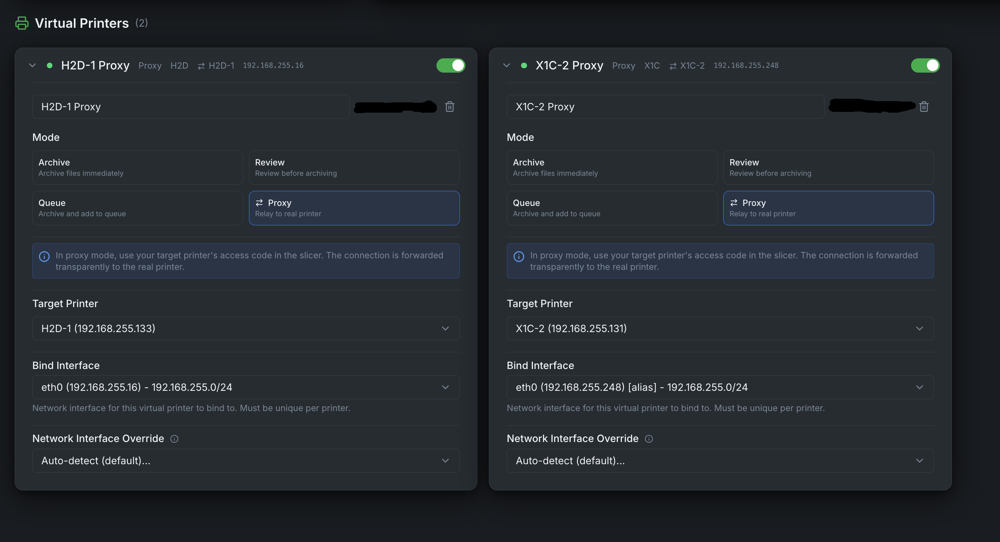

<p align="center">
  
</p>

<h1 align="center">Bambuddy</h1>

<p align="center">
  <strong>Self-hosted print archive and management system for Bambu Lab 3D printers</strong>
</p>

<p align="center">
  <a href="https://github.com/maziggy/bambuddy/releases"></a>
  
  
  
  <a href="https://github.com/maziggy/bambuddy/blob/main/LICENSE"></a>
  <a href="https://github.com/maziggy/bambuddy/stargazers"></a>
  <a href="https://github.com/maziggy/bambuddy/issues"></a>
  <a href="https://discord.gg/aFS3ZfScHM"></a>
  <a href="https://ko-fi.com/maziggy"></a>
</p>

<p align="center">
  <a href="#-features">Features</a> •
  <a href="#-screenshots">Screenshots</a> •
  <a href="#-quick-start">Quick Start</a> •
  <a href="http://wiki.bambuddy.cool">Documentation</a> •
  <a href="https://discord.gg/aFS3ZfScHM">Discord</a> •
  <a href="#-contributing">Contributing</a>
</p>

---

## 🌐 NEW: Remote Printing with Proxy Mode

<p align="center">
  
</p>

**Print from anywhere in the world** — Bambuddy's new Proxy Mode acts as a secure relay between your slicer and printer:

- 🔒 **TLS-encrypted control channels** — MQTT and FTP control fully encrypted
- 🛡️ **VPN recommended** — Use Tailscale/WireGuard for full data encryption ([details](https://wiki.bambuddy.cool/features/virtual-printer/))
- 🌍 **No cloud dependency** — Direct connection through your own Bambuddy server
- 🔑 **Uses printer's access code** — No additional credentials needed
- ⚡ **Full-speed printing** — FTP and MQTT protocols proxied transparently

Perfect for remote print farms, traveling makers, or accessing your home printer from work.

👉 **[Setup Guide →](https://wiki.bambuddy.cool/features/virtual-printer/#proxy-mode-new-in-017)**

---

## Why Bambuddy?

- **Own your data** — All print history stored locally, no cloud dependency
- **Works offline** — Uses Developer Mode for direct printer control via local network
- **Full automation** — Schedule prints, auto power-off, get notified when done
- **Multi-printer support** — Manage your entire print farm from one interface

---

## ✨ Features

<table>
<tr>
<td width="50%" valign="top">

### 📦 Print Archive
- Automatic 3MF archiving with metadata
- 3D model preview (Three.js)
- Duplicate detection & full-text search
- Photo attachments & failure analysis
- Timelapse editor (trim, speed, music)
- Re-print to any connected printer with AMS mapping (auto-match or manual slot selection, multi-plate support)
- Plate thumbnail browsing for multi-plate archives (hover to navigate between plates)
- Archive comparison (side-by-side diff)
- Tag management (rename/delete across all archives)

### 📊 Monitoring & Control
- Real-time printer status via WebSocket
- Live camera streaming (MJPEG) & snapshots with multi-viewer support
- **Streaming overlay for OBS** - Embeddable page with camera + status for live streaming (`/overlay/:printerId`), configurable FPS (`?fps=30`), status-only mode (`?camera=false`)
- External camera support (MJPEG, RTSP, HTTP snapshot, USB/V4L2) with layer-based timelapse
- **Build plate empty detection** - Auto-pause print if objects detected on plate (multi-reference calibration, ROI adjustment)
- Fan status monitoring (part cooling, auxiliary, chamber)
- Printer control (stop, pause, resume, chamber light)
- Resizable printer cards (S/M/L/XL)
- Skip objects during print
- AMS slot RFID re-read
- AMS slot configuration (custom presets, K profiles, color picker)
- HMS error monitoring with history
- Print success rates & trends
- Filament usage tracking
- Cost analytics & failure analysis
- CSV/Excel export

### ⏰ Scheduling & Automation
- Print queue with drag-and-drop
- Multi-printer selection (send to multiple printers at once)
- Model-based queue assignment (send to "any X1C" for load balancing) with location filtering
- Filament validation (only assign to printers with required filaments)
- Per-printer AMS mapping (individual slot configuration for print farms)
- Scheduled prints (date/time)
- Queue Only mode (stage without auto-start)
- Clear plate confirmation between queued prints
- Smart plug integration (Tasmota, Home Assistant, MQTT)
- MQTT smart plugs: Subscribe to Zigbee2MQTT, Shelly, or any MQTT topic for energy monitoring
- Energy consumption tracking (per-print kWh and cost)
- HA energy sensor support (for plugs with separate power/energy sensors)
- Auto power-on before print
- Auto power-off after cooldown

### 📁 File Manager (Library)
- Upload and organize sliced files (3MF, gcode, STL)
- **STL thumbnail generation** - Auto-generate previews for STL files on upload or batch generate for existing files
- ZIP file extraction with folder structure preservation
- Option to create folder from ZIP filename
- Folder structure with drag-and-drop
- Rename files and folders via context menu
- Print directly to any printer with full options
- Add to queue without creating archive upfront
- Plate selection for multi-plate 3MF files
- Duplicate detection via file hash
- Mobile-friendly with always-visible action buttons

### 📁 Projects
- Group related prints (e.g., "Voron Build")
- Track plates (print jobs) and parts separately
- Auto-detect parts count from 3MF files
- Color-coded project badges
- Bulk assign archives via multi-select toolbar
- Import/Export projects as ZIP (includes files) or JSON

</td>
<td width="50%" valign="top">

### 🔔 Notifications
- WhatsApp, Telegram, Discord
- Email, Pushover, ntfy
- Custom webhooks
- Quiet hours & daily digest
- Customizable message templates
- Print finish photo URL in notifications
- HMS error alerts (AMS, nozzle, etc.)
- Build plate detection alerts
- Queue events (waiting, skipped, failed)

### 🧵 Spool Inventory
- Built-in spool inventory with AMS slot assignment, usage tracking, and remaining weight management
- Automatic filament consumption tracking: AMS RFID for Bambu Lab spools, 3MF estimates for third-party spools
- Spool catalog, color catalog, PA profile matching, and low-stock alerts

### 🔧 Integrations
- [Spoolman](https://github.com/Donkie/Spoolman) filament sync with per-filament usage tracking and fill level display
- MQTT publishing for Home Assistant, Node-RED, etc.
- **Prometheus metrics** - Export printer telemetry for Grafana dashboards
- Bambu Cloud profile management
- **Local Profiles** - Import OrcaSlicer presets (`.orca_filament`, `.bbscfg`, `.bbsflmt`, `.zip`, `.json`) without Bambu Cloud
- K-profiles (pressure advance)
- **GitHub backup** - Schedule automatic backups of cloud profiles, k profiles and settings to GitHub
- External sidebar links
- Webhooks & API keys
- Interactive API browser with live testing

### 🖨️ Virtual Printer & Remote Printing
- **🌐 Proxy Mode (NEW!)** — Print remotely from anywhere via secure TLS relay
- Emulates a Bambu Lab printer on your network
- Send prints directly from Bambu Studio/Orca Slicer
- Configurable printer model (X1C, P1S, A1, H2D, etc.)
- Archive mode, Review mode, Queue mode, or Proxy mode
- SSDP discovery (same LAN) or manual IP entry (VPN/remote)
- Network interface override for multi-NIC/Docker/VPN setups
- Secure TLS/MQTT/FTP communication

### 🛠️ Maintenance & Support
- Maintenance scheduling & tracking
- Interval reminders (hours/days)
- Print time accuracy stats
- File manager for printer storage
- Firmware update helper with version badge (LAN-only printers)
- Debug logging toggle with live indicator
- Live application log viewer with filtering
- Support bundle generator with comprehensive diagnostics (privacy-filtered)

### 🔒 Optional Authentication
- Enable/disable authentication any time
- Group-based permissions (50+ granular permissions)
- Default groups: Administrators, Operators, Viewers
- JWT tokens with secure password hashing
- Comprehensive API protection (200+ endpoints secured)
- User management (create, edit, delete, groups)
- User activity tracking (who uploaded archives, library files, queued prints, started prints)
- **Advanced Auth via Email** — SMTP integration for automated user onboarding and self-service password resets
- Admin creates users with email — system sends secure random password automatically
- Users can reset their own password from the login screen (no admin needed)
- Customizable email templates (welcome email, password reset)

</td>
</tr>
</table>

**Plus:** Configurable slicer (Bambu Studio / OrcaSlicer) • Customizable themes (style, background, accent) • Mobile responsive • Keyboard shortcuts • Multi-language (EN/DE) • Auto updates • Database backup/restore • System info dashboard

---

## 🎬 Demo

<p align="center">
  <a href="https://youtu.be/bmq2Z0lEXeo">
    
  </a>
  <br><em>Click to watch the demo on YouTube</em>
</p>

---

## 📸 Screenshots

<details>
<summary><strong>Click to expand screenshots</strong></summary>

<p align="center">
  
  <br><em>Real-time printer monitoring with AMS status</em>
</p>

<p align="center">
  
  <br><em>Print archive with 3D preview and project assignment</em>
</p>

<p align="center">
  
  <br><em>Re-print with AMS filament mapping preview</em>
</p>

<p align="center">
  
  <br><em>Built-in timelapse editor with trim, speed, and music</em>
</p>

<p align="center">
  
  <br><em>Group related prints into projects</em>
</p>

<p align="center">
  
  <br><em>Project detail view with assigned archives</em>
</p>

<p align="center">
  
  <br><em>Project timeline and print history</em>
</p>

<p align="center">
  
  <br><em>Print scheduling and queue management</em>
</p>

<p align="center">
  
  <br><em>Schedule prints for specific date and time</em>
</p>

<p align="center">
  
  <br><em>Customizable statistics dashboard</em>
</p>

<p align="center">
  
  <br><em>Maintenance tracking per printer</em>
</p>

<p align="center">
  
  <br><em>Configure maintenance types and intervals</em>
</p>

<p align="center">
  
  <br><em>Bambu Cloud filament profiles</em>
</p>

<p align="center">
  
  <br><em>Edit filament preset settings</em>
</p>

<p align="center">
  
  <br><em>Pressure advance (K-factor) profiles</em>
</p>

<p align="center">
  
  <br><em>Edit K-factor profile settings</em>
</p>

<p align="center">
  
  <br><em>General configuration and integrations</em>
</p>

<p align="center">
  
  <br><em>Smart plug control and energy monitoring</em>
</p>

<p align="center">
  
  <br><em>Multi-provider notification system</em>
</p>

<p align="center">
  
  <br><em>API keys and webhook endpoints</em>
</p>

<p align="center">
  
  <br><em>Virtual printer configuration</em>
</p>

<p align="center">
  
  <br><em>Virtual printer appears in Bambu Studio/Orca Slicer</em>
</p>

<p align="center">
  
  <br><em>MQTT debug logging for troubleshooting</em>
</p>

<p align="center">
  
  <br><em>Quick power plug control in sidebar</em>
</p>

</details>

---

## 🚀 Quick Start

### Requirements
- Python 3.10+ (3.11/3.12 recommended)
- Bambu Lab printer with **Developer Mode** enabled (see below)
- Same local network as printer

### Installation

#### Docker (Recommended)

**Option A: Pre-built image (fastest)**
```bash
mkdir bambuddy && cd bambuddy
curl -O https://raw.githubusercontent.com/maziggy/bambuddy/main/docker-compose.yml
docker compose up -d
```

**Option B: Build from source**
```bash
git clone https://github.com/maziggy/bambuddy.git
cd bambuddy
docker compose up -d --build
```

Open **http://localhost:8000** in your browser.

> **Multi-architecture support:** Pre-built images are available for `linux/amd64` and `linux/arm64` (Raspberry Pi 4/5).

> **macOS/Windows users:** Docker Desktop doesn't support `network_mode: host`. Edit docker-compose.yml: comment out `network_mode: host` and uncomment the `ports:` section. Printer discovery won't work - add printers manually by IP.

> **Linux users:** If you get "permission denied" errors, either prefix commands with `sudo` (e.g., `sudo docker compose up -d`) or [add your user to the docker group](https://docs.docker.com/engine/install/linux-postinstall/).

<details>
<summary><strong>Docker Configuration & Commands</strong></summary>

**Environment Variables:**

| Variable | Default | Description |
|----------|---------|-------------|
| `TZ` | `UTC` | Your timezone (e.g., `America/New_York`, `Europe/Berlin`) |
| `PORT` | `8000` | Port BamBuddy runs on (with host networking mode) |
| `DEBUG` | `false` | Enable debug logging |
| `LOG_LEVEL` | `INFO` | Log level: `DEBUG`, `INFO`, `WARNING`, `ERROR` |

**Data Persistence:**

| Volume | Purpose |
|--------|---------|
| `bambuddy.db` | SQLite database with all your print data |
| `archive/` | Archived 3MF files and thumbnails |
| `logs/` | Application logs |

**Updating:**

```bash
# Pre-built image: just pull the latest
docker compose pull && docker compose up -d

# From source: rebuild after pulling changes
cd bambuddy && git pull && docker compose up -d --build
```

**Useful Commands:**

```bash
# View logs
docker compose logs -f

# Stop/Start
docker compose down
docker compose up -d

# Shell access
docker compose exec bambuddy /bin/bash
```

**Custom Port:**

```yaml
ports:
  - "3000:8000"  # Access on port 3000
```

**Reverse Proxy (Nginx):**

```nginx
server {
    listen 443 ssl http2;
    server_name bambuddy.yourdomain.com;

    ssl_certificate /path/to/cert.pem;
    ssl_certificate_key /path/to/key.pem;

    location / {
        proxy_pass http://localhost:8000;
        proxy_http_version 1.1;
        proxy_set_header Upgrade $http_upgrade;
        proxy_set_header Connection "upgrade";
        proxy_set_header Host $host;
        proxy_set_header X-Real-IP $remote_addr;
        proxy_set_header X-Forwarded-For $proxy_add_x_forwarded_for;
        proxy_set_header X-Forwarded-Proto $scheme;
        proxy_read_timeout 86400;
    }
}
```

> **Note:** WebSocket support is required for real-time printer updates.

**Network Mode Host** (required for printer discovery and camera streaming):

```yaml
services:
  bambuddy:
    build: .
    network_mode: host
```

> **Note:** Docker's default bridge networking cannot receive SSDP multicast packets for automatic printer discovery. When using `network_mode: host`, Bambuddy auto-detects your network subnet and can discover printers via subnet scanning in the Add Printer dialog.

</details>

#### Windows (Portable Launcher)

The easiest way to run Bambuddy on Windows - no installation required:

```batch
git clone https://github.com/maziggy/bambuddy.git
cd bambuddy
start_bambuddy.bat
```

Double-click `start_bambuddy.bat` and it will:
- Download Python and Node.js automatically (portable, no system changes)
- Install dependencies and build the frontend
- Open your browser to http://localhost:8000

Everything is stored in the `.portable\` folder. Use `start_bambuddy.bat reset` to clean up.

> **Custom port:** `set PORT=9000 & start_bambuddy.bat`

#### Manual Installation (Linux/macOS)

```bash
# Clone and setup
git clone https://github.com/maziggy/bambuddy.git
cd bambuddy
python3 -m venv venv
source venv/bin/activate
pip install -r requirements.txt

# Run
uvicorn backend.app.main:app --host 0.0.0.0 --port 8000
```

Open **http://localhost:8000** and add your printer!

> **Need detailed instructions?** See the [Installation Guide](http://wiki.bambuddy.cool/getting-started/installation/)

### Enabling Developer Mode

Developer Mode allows third-party software like Bambuddy to control your printer over the local network.

1. On printer: **Settings** → **Network** → **LAN Only Mode** → Enable
2. Enable **Developer Mode** (appears after LAN Only Mode is enabled)
3. Note the **Access Code** displayed
4. Find IP address in network settings
5. Find Serial Number in device info

> **Note:** Developer Mode disables cloud features but provides full local control. Standard LAN Mode (without Developer Mode) only allows read-only monitoring.

---

## 📚 Documentation

Full documentation available at **[wiki.bambuddy.cool](http://wiki.bambuddy.cool)**:

- [Installation](http://wiki.bambuddy.cool/getting-started/installation/) — All installation methods
- [Getting Started](http://wiki.bambuddy.cool/getting-started/) — First printer setup
- [Features](http://wiki.bambuddy.cool/features/) — Detailed feature guides
- [Troubleshooting](http://wiki.bambuddy.cool/reference/troubleshooting/) — Common issues & solutions
- [API Reference](http://wiki.bambuddy.cool/reference/api/) — REST API documentation

---

## 🖨️ Supported Printers

| Series | Models |
|--------|--------|
| X1 | X1, X1 Carbon, X1E |
| H2 | H2D, H2D Pro, H2C, H2S |
| P1 | P1P, P1S |
| P2 | P2S |
| A1 | A1, A1 Mini |

---

## 🛠️ Tech Stack

| Component | Technology |
|-----------|------------|
| Backend | Python, FastAPI, SQLAlchemy |
| Frontend | React, TypeScript, Tailwind CSS |
| Database | SQLite |
| 3D Viewer | Three.js |
| Communication | MQTT (TLS), FTPS |

---

## 🤝 Contributing

Contributions welcome! Here's how to help:

1. **Test** — Report issues with your printer model
2. **Translate** — Add new languages
3. **Code** — Submit PRs for bugs or features
4. **Document** — Improve wiki and guides

```bash
# Development setup
git clone https://github.com/maziggy/bambuddy.git
cd bambuddy

# Backend
python3 -m venv venv && source venv/bin/activate
pip install -r requirements.txt
DEBUG=true uvicorn backend.app.main:app --reload

# Frontend (separate terminal)
cd frontend && npm install && npm run dev
```

See [CONTRIBUTING.md](CONTRIBUTING.md) for guidelines.

---

## 📄 License

MIT License — see [LICENSE](LICENSE) for details.

---

## 🙏 Acknowledgments

- [Bambu Lab](https://bambulab.com/) for amazing printers
- The reverse engineering community for protocol documentation
- All testers and contributors

---

If you like Bambuddy and want to support it, you can <a href="https://ko-fi.com/maziggy" target=_blank>buy Martin a coffee</a>.

---

<p align="center">
  Made with ❤️ for the 3D printing community
  <br><br>
  <a href="https://discord.gg/aFS3ZfScHM">Join our Discord</a> •
  <a href="https://github.com/maziggy/bambuddy/issues">Report Bug</a> •
  <a href="https://github.com/maziggy/bambuddy/issues">Request Feature</a> •
  <a href="http://wiki.bambuddy.cool">Documentation</a>
</p>
