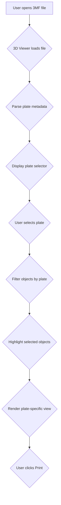

# 3MF Plate Management Feature Plan
## Overview
This plan outlines the implementation of plate management features for the bambuddy 3D viewer. This will allow users to view, select, and manage individual plates within 3MF files, similar to how Bambu Studio handles multi-plate projects.
## Background
### Current 3MF File Structure
3MF files use a hierarchical XML structure to manage multiple build plates:
```
3dmodel.model (root)
├── Metadata/
│   └── model_settings.config  # Plate configuration manager
├── 3dmodel.model (main model data)
│   ├── <object> definitions (unique geometry)
│   └── <build> items (plate assignments)
└── Metadata/
    └── plate_1.png, plate_2.png, etc. (plate thumbnails)
```
### Key Concepts
- **Build Items**: Objects assigned to specific plates via `bambu:plate_id` attribute
- **Plate Configuration**: `Metadata/model_settings.config` manages plate definitions, names, bed types
- **Object Instances**: Each unique object defined once, referenced by multiple build items
- **Transformation Matrix**: Each build item has position, rotation, scale relative to its plate's center
- **Plate Thumbnails**: PNG images showing each plate's layout for preview
## Feature Requirements
### 1. Plate Metadata Parsing
**Goal**: Read and parse `Metadata/model_settings.config` from 3MF files
**Technical Details**:
- Parse XML structure to extract:
  - Plate count
  - Plate names (custom or default)
  - Plate dimensions
  - Bed type per plate (Textured PE, Cool Plate, etc.)
  - Printer type per plate (X1C, A1 mini, etc.)
- Extract plate-to-object mappings from `<build>` items
- Parse object-to-plate assignments from `<object>` `bambu:plate_id` attributes
**Implementation Approach**:
- Use JSZip to extract `Metadata/model_settings.config` from 3MF ZIP
- Parse XML using DOMParser or similar library
- Create TypeScript interfaces for plate metadata
### 2. UI/UX Design
**Goal**: Intuitive plate selection and object management interface
**Components Needed**:
#### A. Plate Selector/Tab System
- **Plate Tabs**: Horizontal tabs showing each plate (Plate 1, Plate 2, etc.)
- **Plate Dropdown**: Dropdown to select active plate
- **Plate Info Panel**: Display plate name, dimensions, bed type
- **Thumbnail Preview**: Show plate thumbnail when selected
#### B. Object Filtering
- **Filter by Plate**: When a plate is selected, show only objects on that plate
- **Object List**: Display objects with their positions on current plate
- **Object Selection**: Allow selecting individual objects (checkbox, multi-select)
- **Object Info**: Show object name, dimensions, material color
#### C. 3D Viewer Enhancements
- **Plate-Specific Rendering**: Render only objects for selected plate
- **Object Highlighting**: Highlight selected objects in 3D view
- **Plate Grid Overlay**: Show build plate boundaries when viewing specific plate
- **Plate Indicator**: Visual indicator of which plate is currently active
#### D. Object Manipulation (Optional - Future Enhancement)
- **Drag and Drop**: Move objects between plates
- **Object Repositioning**: Adjust X/Y/Z position on current plate
- **Object Rotation**: Rotate objects on build plate
- **Object Scaling**: Resize objects
- **Delete from Plate**: Remove object from current plate
- **Add to Plate**: Copy object to different plate
### 3. Data Model Design
**Goal**: Track plate assignments and configurations
**State Structure**:
```typescript
interface Plate {
  id: string;
  name: string;
  width: number;
  depth: number;
  bedType: string;
  printerType: string;
  objectIds: string[];
}
interface ObjectAssignment {
  objectId: string;
  plateId: string;
  position: { x: number; y: number; z: number };
  rotation: { x: number; y: number; z: number };
  scale: { x: number; y: number; z: number };
}
interface ViewerState {
  selectedPlateId: string | null;
  selectedObjectIds: string[];
  filterMode: 'all' | 'plate';
}
```
**Storage Considerations**:
- In-memory state for current session
- Optional: Save plate configurations to localStorage
- Optional: Save to backend as user preferences
### 4. Backend API Requirements
**Goal**: API endpoints for saving/loading plate configurations
**Required Endpoints**:
#### A. Get Plate Metadata
```
GET /api/v1/library/files/{id}/plates
```
Returns plate metadata from 3MF file
#### B. Save Plate Configuration (Optional)
```
POST /api/v1/library/files/{id}/plates/config
Body: {
  plates: Plate[];
  defaultPlateId?: string;
}
```
Save custom plate names, assignments to user preferences
#### C. Get Plate Thumbnail
```
GET /api/v1/library/files/{id}/plates/{plateId}/thumbnail
```
Returns PNG image of specific plate
### 5. Implementation Steps
#### Step 1: 3MF Metadata Parser
- Create `PlateMetadataParser` class
- Implement `parse3MFPlateMetadata(file: File)` method
- Extract `Metadata/model_settings.config` from ZIP
- Parse XML structure
- Return typed plate metadata
#### Step 2: Update ModelViewer Component
- Add `plates` prop to ModelViewerProps
- Add `selectedPlateId` prop to ModelViewerProps
- Add `selectedObjectIds` prop to ModelViewerProps
- Add `filterMode` prop to ModelViewerProps
- Modify `useEffect` to filter objects by selected plate
- Add plate selection state management
- Implement object highlighting for selected objects
- Add plate grid overlay visualization
#### Step 3: Update ModelViewerModal
- Add plate selector UI (tabs or dropdown)
- Display plate information panel
- Show plate thumbnail preview
- Add "All Plates" view option
- Pass selected plate and objects to ModelViewer
#### Step 4: Update FileManagerPage
- Add plate management state
- Add plate selector to file cards (optional)
- Display plate badge on file cards
- Add plate count indicator in file list
#### Step 5: API Client Updates
- Add `getLibraryFilePlates(fileId: number)` method
- Add `saveLibraryFilePlateConfig(fileId: number, config: PlateConfig)` method
- Add `getLibraryFilePlateThumbnail(fileId: number, plateId: string)` method
#### Step 6: Testing
- Test with multi-plate 3MF files
- Test plate selection and object filtering
- Test plate switching
- Test object highlighting
- Verify thumbnail generation
### 6. Technical Considerations
#### A. Coordinate Systems
- **3MF**: Uses local (0,0,0) origin per plate
- **Viewer**: Uses Three.js Y-up coordinate system
- **Challenge**: Need to convert between coordinate systems when rendering specific plates
**Solution**: Store plate origin offset, apply when rendering specific plate
#### B. Performance
- **Lazy Loading**: Load plate metadata on-demand, not entire file upfront
- **Object Culling**: Don't render objects not on current plate
- **Thumbnail Caching**: Cache plate thumbnails
#### C. Backward Compatibility
- **Single Plate Files**: Continue working as-is (show all plates)
- **No Plate Metadata**: Gracefully degrade to full model view
- **STL Files**: Plate management not applicable (no plate structure)
### 7. UI/UX Flow

### 8. Limitations
- **Complexity**: 3MF plate structure is complex, requires careful XML parsing
- **File Size**: Large 3MF files with many plates may have performance impact
- **STL Files**: No plate structure, feature not applicable
- **Testing**: Extensive testing needed for various plate configurations
- **Backward Compatibility**: Must maintain existing single-plate view behavior
### 9. Future Enhancements (Out of Scope)
- **Object Manipulation**: Drag-and-drop, rotation, scaling
- **Plate Creation**: Add new plates, duplicate objects between plates
- **Plate Templates**: Save and reuse plate configurations
- **Batch Operations**: Apply settings to multiple plates at once
- **Visual Plate Editor**: Graphical plate layout designer
## Success Criteria
- [ ] Users can view all plates in a 3MF file
- [ ] Users can select individual plates
- [ ] Objects are filtered by selected plate
- [ ] Selected objects are highlighted in 3D view
- [ ] Plate information is displayed (name, dimensions, bed type)
- [ ] Plate thumbnails are shown
- [ ] Works with both 3MF and STL files
- [ ] Backward compatible with single-plate files
- [ ] Performance is acceptable with large files
- [ ] All existing features continue to work
## Implementation Priority
1. **High**: Core plate parsing and rendering
2. **Medium**: UI components and state management
3. **Low**: Backend API and advanced features
4. **Future**: Object manipulation and plate creation
